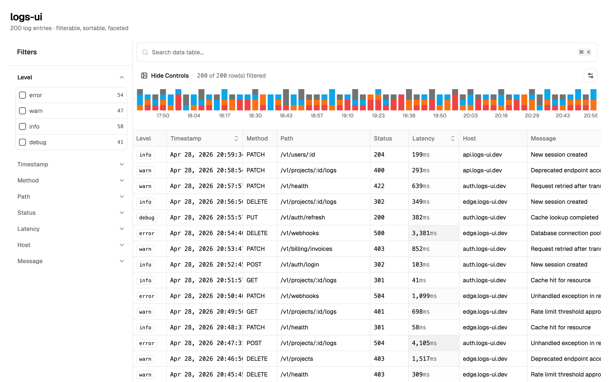
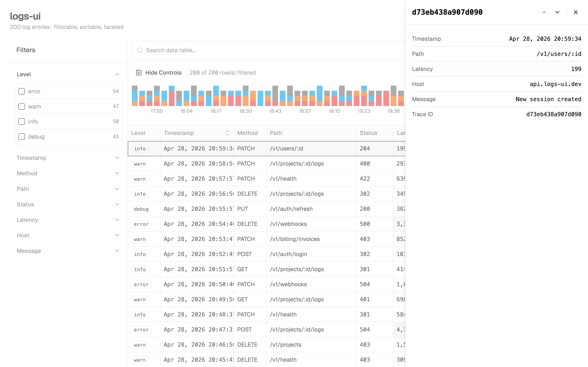

# logs-ui

A Vite + React example of [openstatushq/data-table-filters][repo].

Sparked by [issue #14 "Create a Vite example"][issue] — the upstream repo only ships a Next.js reference app, so I wanted to confirm the same registry blocks work under a Vite + React 19 + Tailwind v4 setup.

[repo]: https://github.com/openstatushq/data-table-filters
[issue]: https://github.com/openstatushq/data-table-filters/issues/14



## What it does

Renders 200 sample API request logs in a data table with filters, sorting, a row-detail side panel, and a timeline chart.

- Faceted filters in the left sidebar (level / timestamp / method / path / status / latency / host / message)
- Command-palette-style search bar
- Stacked-bar timeline at the top (error / warn / info / debug) — drag to apply a time-range filter
- Click a row to open the detail side sheet



## Tech stack

- Vite 8 + React 19 + TypeScript 6
- Tailwind CSS v4 (`@tailwindcss/vite`)
- shadcn/ui (Neutral palette / Nova preset)
- [data-table-filters][repo] registry blocks (core / schema / cell / sheet / filter-command)
- TanStack Table v8 + React Virtual + recharts + cmdk + date-fns

The state adapter is **memory-only**. URL state (nuqs) and the React Query fetch layer aren't wired up — drop in the registry's `data-table-nuqs` / `data-table-query` blocks if you need them.

## Getting started

```sh
npm install
npm run dev      # http://localhost:5173
npm run build    # tsc -b && vite build
```

## Migration notes (deltas vs. the Next.js-shaped registry)

The registry blocks run on Vite almost out of the box, but a few adjustments were needed:

- `data-table-infinite.tsx`: `process.env.NEXT_PUBLIC_TABLE_DEBUG` → `import.meta.env.VITE_TABLE_DEBUG`
- Removed `verbatimModuleSyntax` / `noUnusedLocals` / `noUnusedParameters` / `erasableSyntaxOnly` from `tsconfig.app.json` (to match the registry's code style)
- Two dependency files (`src/lib/request/status-code.ts`, `src/lib/data-table/faceted.ts`) aren't currently emitted by the registry, so I copied them by hand from the upstream `packages/registry`

## Project layout

```
src/
├─ App.tsx                   # wraps LogsTable in a TooltipProvider
├─ components/
│  ├─ logs-table.tsx         # DataTableInfinite + memory adapter wrapper
│  ├─ logs-timeline.tsx      # recharts stacked bar + drag-to-zoom
│  ├─ data-table/            # data-table-filters registry blocks
│  └─ ui/                    # shadcn primitives
└─ lib/
   ├─ logs-schema.ts         # table schema built with col.presets.*
   ├─ logs-data.ts           # deterministic sample log generator (Mulberry32)
   ├─ table-schema/          # data-table-schema registry
   └─ store/                 # data-table BYOS adapter / hooks
```
